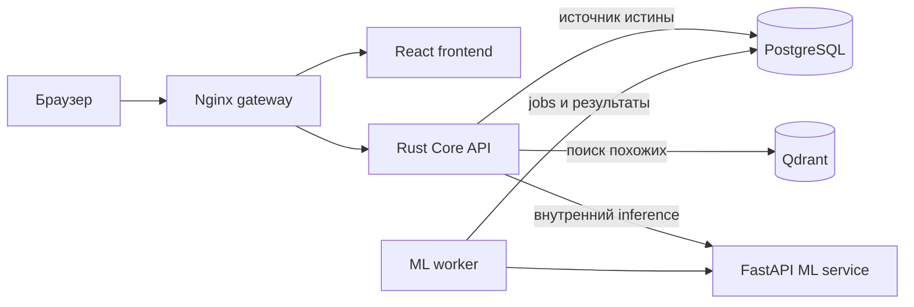
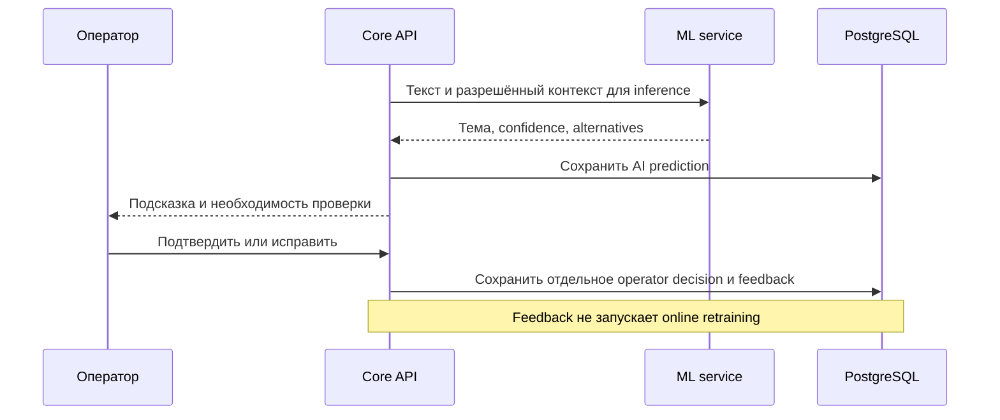

# Pulse 109

## 1. Кратко о проекте

Pulse 109 — демонстрационный AI-слой для системы приёма обращений 109. Он
помогает оператору проверить тему, приоритет и адресата обращения, а
руководителю — увидеть поток, сигналы и прогноз. Официальный статус,
исполнитель и отправка ответа остаются во внешней системе 109.

Инженерная задача — связать подсказку модели с проверяемым решением человека
и аналитикой, сохраняя границу доступа к данным. Pulse хранит собственное
состояние в PostgreSQL, использует Qdrant как индекс векторов и обращается к
ML только через Core API. Показ основан на 160 синтетических обращениях;
качество на реальных данных 109 этим demo не доказано.

### Работа по неделям

Работу начали 4 сентября. Коммиты в этом репозитории фиксируют разработку с
21 сентября; до этого команда готовила продуктовый и технический план.

| Период | `hhhhhffd` — ML и техническое лидерство | `amblackrust` — продукт и приложение |
| --- | --- | --- |
| 4–10 сентября: ожидание данных | Определил требования к данным, ограничения по PII и способы проверить ML без рабочей выгрузки. | Разобрал путь обращения 109, роли оператора и руководителя, цели демонстрации. |
| 11–17 сентября: план продукта | Выделил ML-сценарии, границы demo и критерии качества рекомендаций. | Составил пользовательские сценарии, приоритеты MVP и критерии приёмки. |
| 18–24 сентября: технический план и первый контур | Спроектировал границы Core/ML, контракты данных и связку PostgreSQL–Qdrant; собрал первый сквозной demo-контур. | Проработал Core API, роли и требования к рабочим экранам оператора и руководителя. |
| 25 сентября — 1 октября: разработка и сборка | Развил ML/data pipeline и оценку моделей, свёл ветки, разрешил конфликты и подготовил demo к запуску. | Реализовал операторские функции, аналитику, сигналы, learning loop и финальный интерфейс. |

**Сейчас работает:** операторская проверка обращений с сохранением решения,
поиск похожих, обзор и отчёты, прогноз, сигналы и контролируемый цикл candidate
model. Всё показано на синтетических данных; интеграция с рабочей 109 и
проверка качества на её данных остаются отдельными задачами.

## 2. Технологии

| Контур | Что используется | Роль |
| --- | --- | --- |
| Core | Rust, Axum, SQLx, Tokio | HTTP API, auth/RBAC, транзакции, аудит и бизнес-правила |
| Frontend | React 19, TypeScript, Vite, ECharts | Рабочее место и обзор через Core API |
| Data | PostgreSQL 16, Qdrant | Состояние Pulse и отдельный vector index |
| AI/ML | Python 3.12, FastAPI, StatsForecast | Внутренние inference, embeddings, forecast и evaluation |
| Infra | Docker Compose, Nginx | Воспроизводимый demo stack и единый HTTP gateway |

По умолчанию классификация RU/KZ и embeddings детерминированные. Прогноз
использует baseline `SeasonalNaive`; optional LLM отключён. Репозиторий
содержит контракты и процесс обучения candidate, но не заявляет обученную
production модель или подтверждённые метрики качества на обращениях заказчика.

## 3. Архитектура



Nginx направляет `/api/*` в Core и не публикует `/internal/*`. Frontend не
обращается к ML service напрямую. В Compose сервис базы данных называется
`postgres`; внутренний адрес Core — `postgres:5432`, а не адрес хоста. Qdrant
хранит векторы и минимальный allow-listed payload, поэтому индекс можно
восстановить из PostgreSQL.



### Архитектурные решения

1. **Core — единственная граница доступа.** Здесь проверяются роли, входные
   данные и бизнес-операции; ML service остаётся внутренним вычислительным
   компонентом. Это не позволяет frontend обходить auth/RBAC.
2. **PostgreSQL и Qdrant решают разные задачи.** Решения, версии моделей,
   feedback и audit живут в PostgreSQL; Qdrant ускоряет поиск похожих
   обращений и не дублирует полный текст или PII.
3. **Выпуск модели контролирует человек.** Feedback проходит `COLLECT →
   TRAINING → EVALUATE → human PROMOTE/REJECT`. Candidate не заменяет
   production автоматически; версии и evidence сохраняются отдельно.

Подробности: [архитектура](docs/architecture.md),
[контракты данных](docs/data-contract.md),
[learning loop](docs/learning-loop.md) и [границы PII](docs/privacy.md).

## 4. Запуск и деплой

### Локальный demo

Нужны Docker Engine и Compose v2. Из корня репозитория:

```bash
cp .env.example .env
docker compose --profile demo config
docker compose --profile demo up --build -d
docker compose --profile demo ps
scripts/smoke
```

Откройте `http://localhost:8012`. `demo-seed` проверяет manifest и загружает
синтетические обращения; успешный контейнер завершится с кодом `0`.
`/healthz` сообщает о живом процессе, `/readyz` — о готовности зависимостей,
миграций и модели. Повторный запуск seed идемпотентен.

Ключевые значения из [`.env.example`](.env.example):

| Переменная | Demo default | Значение |
| --- | --- | --- |
| `PULSE_HTTP_PORT` | `8012` | Единственный опубликованный порт: Nginx на `127.0.0.1` хоста |
| `PULSE_PUBLIC_HOST` | пусто | Домен, разрешённый для Vite preview при публичном demo |
| `POSTGRES_DB` | `pulse` | База PostgreSQL |
| `POSTGRES_USER` | `pulse` | Demo пользователь |
| `POSTGRES_PASSWORD` | `pulse_demo_only` | Только локальный demo пароль |
| `PULSE_DEV_AUTH` | `true` | Выбор роли для demo, без внешней идентификации |
| `CORS_ALLOWED_ORIGINS` | `http://localhost:8012` | Разрешённый browser origin |

`.env` не коммитится. Для остановки без удаления данных:

```bash
docker compose --profile demo down
```

### Выделенный сервер

Compose привязывает host ports к `127.0.0.1`. Для показа по сети запустите
этот же demo stack на сервере и поставьте перед ним HTTPS ingress с
ограничением доступа для приглашённых зрителей. Не публикуйте напрямую Core,
ML, PostgreSQL или Qdrant; `PULSE_DEV_AUTH=true` не заменяет идентификацию.
Пошаговый порядок, пример reverse proxy, обновление и проверки приведены в
[deployment guide](docs/deployment.md).

### Проверки и границы результата

```bash
docker compose --profile demo config
cargo test --manifest-path backend/Cargo.toml
npm run build --prefix frontend
scripts/smoke
```

Для host-запуска Rust теста PDF-экспорта нужен `weasyprint`; runtime Docker
image уже содержит его. Дополнительные уровни проверки описаны в
[testing guide](docs/testing.md). OpenAPI: [Core](docs/openapi/core.openapi.yaml)
и [ML](docs/openapi/ml.openapi.yaml). Подробные контракты:
[Data/ML](docs/contracts.md) и [model registry](docs/model-registry.md).

В demo есть 20 регионов, 16 тем и 160 синтетических RU/KZ обращений.
Production identity, синхронизация с рабочей 109, официальный routing и
проверенные метрики на данных заказчика пока требуют отдельных входных данных
и интеграции. Нельзя использовать demo показатели как оценку реального качества.
