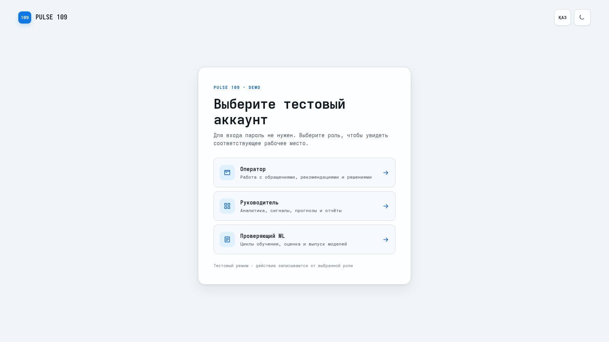
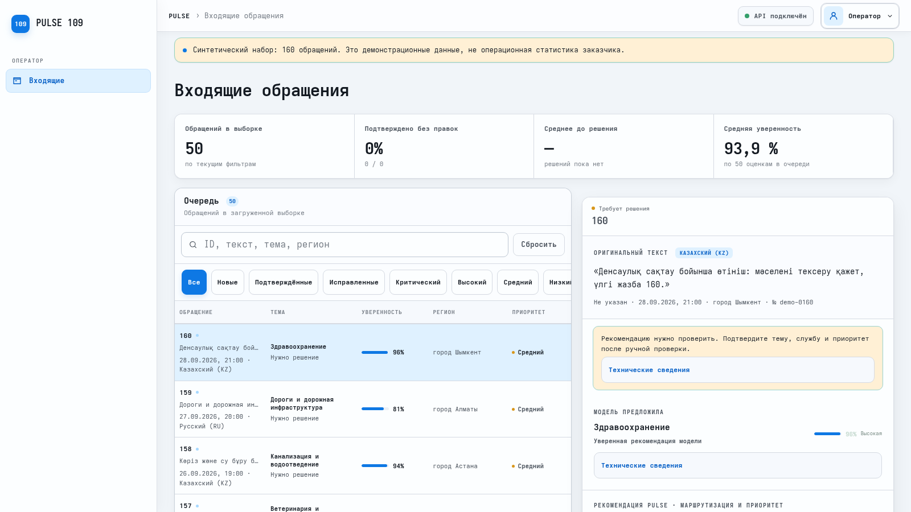
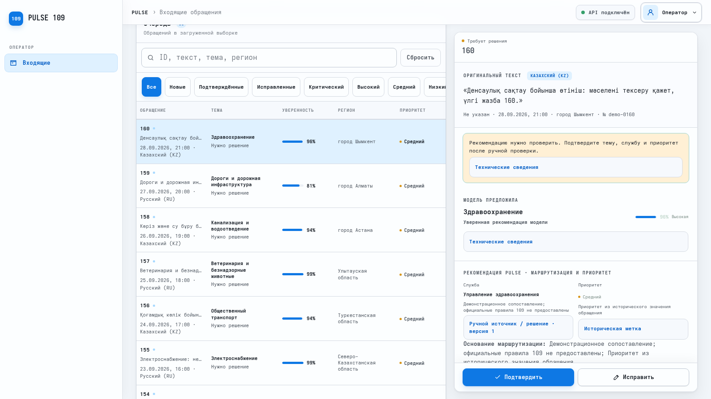
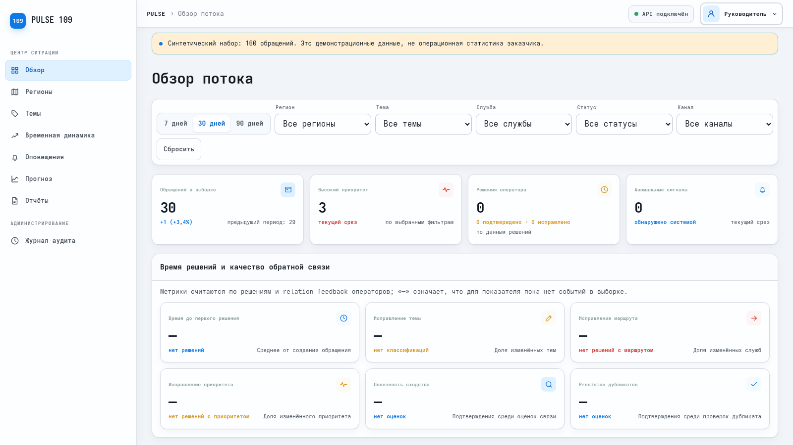
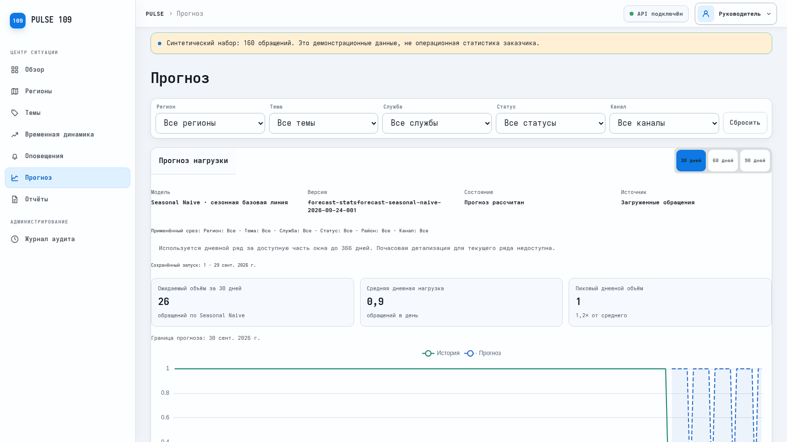

# Pulse 109: сценарий записи и выступления

## Что требуют присланные правила Demo Day

- На сцене показывают **заранее записанное видео продукта**, а речь объясняет происходящее на экране. На всю команду отведено **строго 2 минуты**. Поэтому основная история и честная оговорка о demo должны поместиться в эти две минуты; отдельная минута после ролика правилами на фото не обещана.
- Сдать видео **до 2:00**, **16:9**, **MP4**. Загрузить в свой Google Drive, открыть доступ по ссылке и вставить ссылку в Google Form. На фото указан срок **29 сентября, 23:59**.
- На фото выступление Pulse 109 стоит **2 октября, 15:36–15:57**, в Digital Bridge — Pitching Zone. Это блок программы; персональные две минуты нужно уточнить у организатора на месте.
- Не показывать слайды с перечнем функций. История ролика: **обращение → подсказка → решение оператора → обзор для руководителя → ценность**.

Дальше — инструкция для первого дубля. **Реплики предназначены для живой речи поверх заранее записанного видео**; при записи прогоните их вслух, чтобы кадры и слова совпали. Названия кнопок ниже совпадают с работающим интерфейсом.

## За 10 минут до записи

1. Подключить питание, отключить уведомления, закрыть лишние вкладки и документы. Для записи выставить экран **16:9**, например 1920×1080 или 1600×900, масштаб браузера **100%**. Записывать только окно продукта без терминала.
2. Открыть `http://localhost:8080/?v=20260929`. Параметр `v` помогает получить свежую сборку интерфейса, если страница раньше уже открывалась. Если сразу виден рабочий экран, в правом верхнем углу нажать **Профиль → Выйти**, чтобы начать ролик с выбора роли.
3. Убедиться, что роль ещё не выбрана и интерфейс на русском. Пароль в demo не нужен. После входа сверху должна появиться плашка «Синтетический набор: 160 обращений». Это записи версии `demo-2026-09-29.v1` с датами с 22 апреля по 28 сентября 2026 года.
4. До записи один раз проверить стек командами ниже. Для первого дубля **не нажимать «Подтвердить» заранее**: в кадре обращение 160 должно требовать решения.
5. Один раз пройти маршрут с таймером **до кнопки «Подтвердить»**, не нажимая её. Затем вернуться через **Профиль → Выйти** на стартовый экран, включить запись и сделать полный дубль. Если тайминг выходит за 1:55, убрать последний переход в «Прогноз».

Если после перезапуска компьютера контейнеры не работают, из каталога проекта выполнить:

```bash
COMPOSE_PROJECT_NAME=pulse109-tests docker compose --profile demo up -d
```

Проверка:

```bash
COMPOSE_PROJECT_NAME=pulse109-tests docker compose --profile demo ps
PULSE_BASE_URL=http://127.0.0.1:8080 scripts/smoke
```

Ожидается, что Core, ML, PostgreSQL и Qdrant имеют статус `healthy`, `demo-seed` завершился с кодом `0`, а smoke напечатал `Pulse 109 smoke checks passed.` Если вместо этого видно **API недоступен**, запись не начинать: сначала повторить проверку.

## Ролик: клики и слова по секундам

**Цель длины — 1:50–1:55**, чтобы MP4 точно не превысил 2:00. Записывайте движение мыши и экран, но не гонитесь за каждым пунктом меню. Каждый кадр ниже показывает реальное действие пользователя.

| Время | Что сделать на экране | Что сказать в этот момент |
| --- | --- | --- |
| **0:00–0:12** | На стартовой странице навести курсор на карточку **Оператор**. | «Оператору 109 нужно быстро понять суть обращения и выбрать, кому его направить. Pulse 109 помогает сделать это в одном рабочем окне». |
| **0:12–0:28** | Нажать **Оператор**. Дождаться заголовка **Входящие обращения**. Указать курсором на очередь слева и карточку справа. | «Слева очередь обращений, справа вся информация для решения. Сейчас это 160 синтетических примеров на русском и казахском языках». |
| **0:28–0:48** | В первой строке очереди нажать **160**; на широком экране карточка уже выбрана автоматически. Показать казахский исходный текст и блок **Модель предложила**. | «Откроем обращение 160. Система прочитала казахский текст и предложила тему “Здравоохранение”. Это подсказка оператору, а не автоматическое решение». |
| **0:48–1:08** | Поставить курсор **над левой очередью** и прокрутить **всю страницу** вниз примерно на 250–300 пикселей. Справа будут видны блок **Рекомендация Pulse**, служба **Управление здравоохранения**, приоритет **Средний** и **синяя широкая кнопка “Подтвердить” внизу правой карточки**. Нажать именно эту синюю кнопку. | «Здесь видны рекомендованная служба и приоритет. Оператор проверяет их и подтверждает маршрут. Именно это действие фиксируется как решение человека». |
| **1:08–1:22** | На несколько секунд оставить карточку с надписью **Подтверждено**. Не нажимать кнопки у похожих обращений. | «Прогноз модели и подтверждённое решение хранятся раздельно. Официальный статус обращения во внешней 109 от этого не меняется». |
| **1:22–1:38** | Вверху справа нажать **Профиль → Выйти**, затем на экране выбора нажать **Руководитель**. | «Теперь переключимся на руководителя. Ему нужен общий поток и результат работы операторов, а не текст каждой карточки». |
| **1:38–1:50** | На странице **Обзор потока** нажать **30 дней**. Показать счётчик обращений и карточку **Решения оператора**. После подтверждения 160 там должно быть одно решение. | «За выбранный период видны объём обращений, приоритеты и решения операторов. Аналитика строится по тем же сохранённым событиям». |
| **1:50–1:55** | Если уложились по времени, слева нажать **Прогноз** и оставить экран с переключателями **30 / 60 / 90 дней**. Если времени нет, закончить на обзоре. | «Это работающий demo-контур. Качество на данных заказчика проверим на следующем этапе». |

**Важно при прокрутке:** колесо мыши над правой карточкой прокручивает только её содержимое и может спрятать нужную рекомендацию. Для кадра с синей кнопкой прокрутите страницу, держа курсор над **левой очередью**. На снимке ниже показан правильный кадр перед нажатием.

### Визуальная шпаргалка

**1. Старт:** выбрать «Оператор».



**2. Очередь:** обращение 160 находится сверху; справа открыт его исходный текст.



**3. Решение:** после небольшой прокрутки всей страницы видны рекомендация и синяя кнопка внизу **правой** карточки.



**4. Руководитель:** на «Обзоре» выбрать 30 дней и показать счётчики. Снимок сделан до подтверждения; в записываемом дубле счётчик решений должен увеличиться.



**5. Прогноз:** короткий завершающий кадр, если осталось время. Ровная линия здесь ожидаема: это синтетический набор, и её нельзя выдавать за точность на реальной нагрузке.



## Что есть, чего нет и что будет на втором этапе

| Уже работает в demo | Пока отсутствует или не доказано | Второй этап |
| --- | --- | --- |
| Очередь, подсказка по теме и службе, решение оператора, похожие обращения, аналитика, сигналы, прогноз, отчёты | Реальная выгрузка 109 в полном объёме; подтверждённая точность модели и экономия времени; синхронизация с рабочей 109; промышленная авторизация | Согласовать данные и права; получить правила и API 109; разметить независимую выборку RU/KZ; измерить качество и время работы против текущего процесса; подключить интеграцию и доступы; провести пилот |

## Если дадут ещё 1 минуту после ролика

На присланных фото **отдельная минута не гарантирована**: там указаны строго две минуты на команду. Этот текст нужен, если жюри отдельно попросит назвать ограничения и следующий шаг.

«Сейчас работает сценарий от обращения до решения оператора и обзора руководителя. Также есть поиск похожих обращений, сигналы, прогноз и отчёты. Для показа мы используем только 160 синтетических обращений, поэтому не называем точность на реальных данных или сэкономленные минуты. Действующий классификатор в demo основан на правилах; рабочая система 109 и промышленная авторизация пока не подключены. На втором этапе после согласования данных и API мы вместе с экспертами разметим независимую выборку на русском и казахском, сравним качество с текущим процессом, проверим прогноз на реальной истории, подключим интеграцию и роли, а затем проведём пилот с операторами. Выпуск модели останется решением человека».

## Ответы на вопросы — до 3 минут

Не читать всю таблицу подряд. Выбрать ответ на заданный вопрос и уложиться примерно в 15–20 секунд.

| Если спросят | Ответ простыми словами |
| --- | --- |
| **Зачем это, если 109 уже существует?** | «Официальная 109 остаётся основной системой. Pulse собирает для оператора подсказку по теме и адресату обращения, а руководителю показывает картину по потоку. Реальную экономию времени будем измерять в пилоте». |
| **Это реальные обращения?** | «Нет. На экране 160 синтетических записей, что прямо подписано в интерфейсе. Сейчас показываем работающий процесс. Для результатов на реальных данных сначала нужны согласование и право их использовать». |
| **Насколько точна модель?** | «Показанные 96% — уверенность подсказки по этому примеру, не доказанная точность системы. Её измерим на отдельной проверенной выборке русских и казахских обращений и сравним с нынешним процессом». |
| **Pulse сам отправляет обращения в службы?** | «Нет. В этом demo он предлагает маршрут, а оператор подтверждает или исправляет его. Официальный статус и отправка ответа остаются в 109. Подключение рабочей системы — следующий этап». |
| **Она сама учится на каждом исправлении?** | «Нет. Исправление сохраняется как обратная связь. Новую версию модели можно выпустить только после отдельного обучения, проверки и решения ответственного человека». |
| **Что с персональными данными?** | «В этом demo реальных персональных данных нет. Для пилота понадобится согласованный закрытый контур, разграничение доступа и отдельная проверка требований заказчика». |
| **Прогноз уже точный?** | «Экран прогноза и горизонты 30, 60 и 90 дней работают. На синтетических записях нельзя доказать точность. На втором этапе сравним прогноз с фактической историей обращений». |
| **Когда второй этап?** | «Следующий шаг зависит от доступа к данным и API 109. После согласования этих входов можно зафиксировать план пилота и измеримые критерии; сейчас обещать дату выпуска модели было бы нечестно». |

## После записи

1. Просмотреть ролик целиком. Проверить, что видно **сам продукт и изменение статуса обращения после нажатия**, курсор не скачет, нет всплывших уведомлений, а слова совпадают с кадрами. Если речь будет живой на сцене, несколько раз прогнать её под готовый ролик.
2. Проверить свойства файла: **MP4**, кадр **16:9**, длительность **меньше 2:00**. Лучше оставить запас и получить 1:50–1:55. Не ускорять интерфейс настолько, что жюри не успеет прочитать надписи.
3. Загрузить MP4 в свой Google Drive, включить доступ по ссылке и проверить ссылку в приватном окне. Затем вставить её в Google Form. По фото дедлайн — **сегодня, 29 сентября, 23:59**.

### Если нужен второй дубль

После первого нажатия **Подтвердить** обращение 160 уже не будет «Требует решения». Если нужен чистый повтор, следующая команда удалит **только данные Compose project `pulse109-tests`** и заново загрузит 160 синтетических обращений. Убедитесь, что в команде указан именно `pulse109-tests`:

```bash
COMPOSE_PROJECT_NAME=pulse109-tests PULSE_CONFIRM_RESET=1 scripts/demo-reset
PULSE_BASE_URL=http://127.0.0.1:8080 scripts/smoke
```

После сброса открыть стартовую страницу заново и проверить, что у обращения 160 снова написано **Требует решения**. Если на экране виден статус **API недоступен**, не записывать ролик до успешного smoke. Если кадры записались слишком медленно, из последнего шага можно убрать вкладку «Прогноз» и завершить на обзоре руководителя.

## Проверено для этого показа

- Чистый Compose-запуск: Core, ML, PostgreSQL и Qdrant healthy; `demo-seed` импортировал и проиндексировал 160 записей.
- `scripts/smoke` прошёл через public Nginx; сквозной `scripts/e2e_acceptance.py` прошёл импорт, operator workflow, similarity, analytics, alerts/SSE, forecast, reports, learning и RBAC. После E2E demo заново очищен и заполнен fixture.
- `cargo test`: 64 модульных и 34 API-теста; для PDF-теста на хосте использован WeasyPrint из Core image.
- `npm test`: 5 тестов; `npm run build` прошёл. `data/tests`: 93 теста; `tests/contract`: 19 тестов; ML `pytest`: 71 тест; ML contract validator прошёл.
- В Chromium через Playwright открыты обе роли, очередь, карточка обращения 160 и прогноз; дата последней записи — 28 сентября 2026 года. На прогнозе источник подписан «Загруженные обращения» без намёка на реальные данные.

Не проверялись сегодня нагрузка и промышленное развёртывание. На синтетическом наборе нельзя оценить фактическую точность модели или экономию времени операторов.
